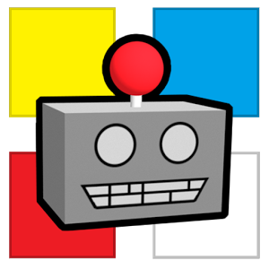
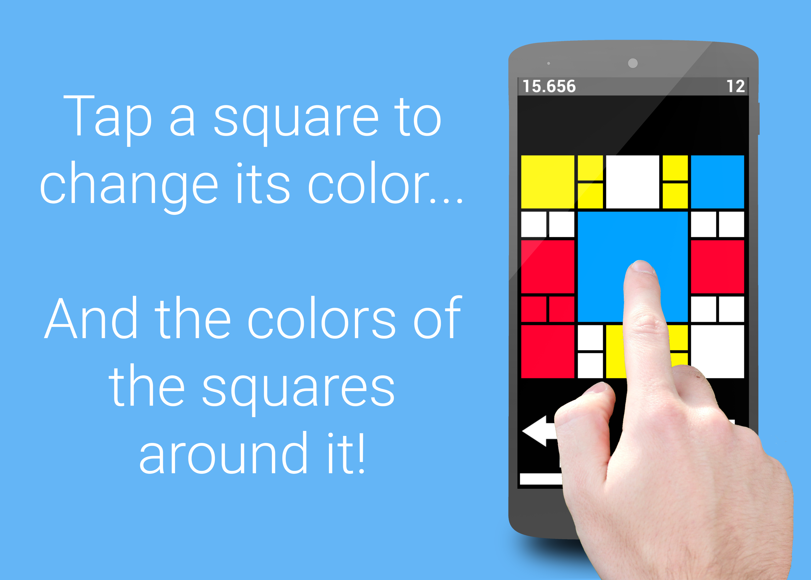
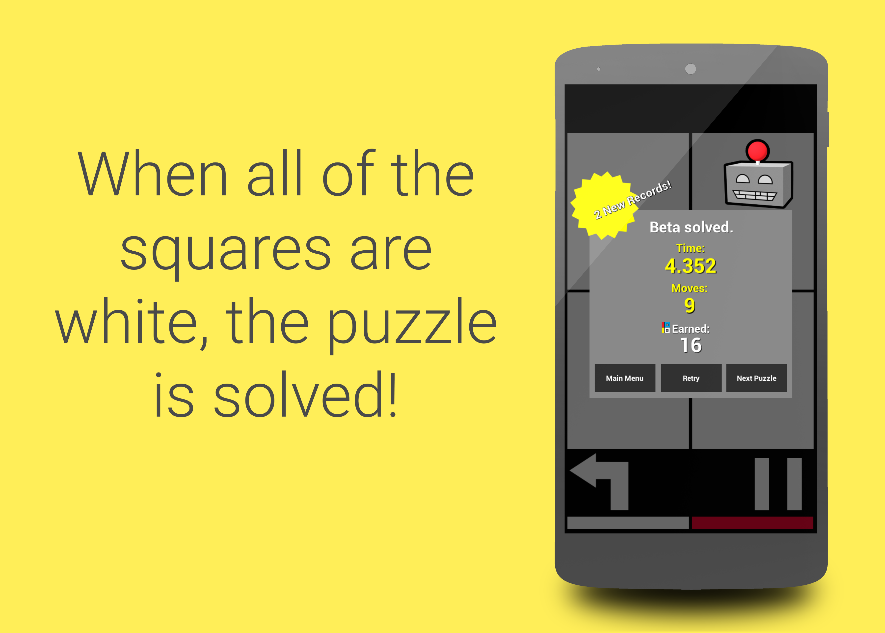
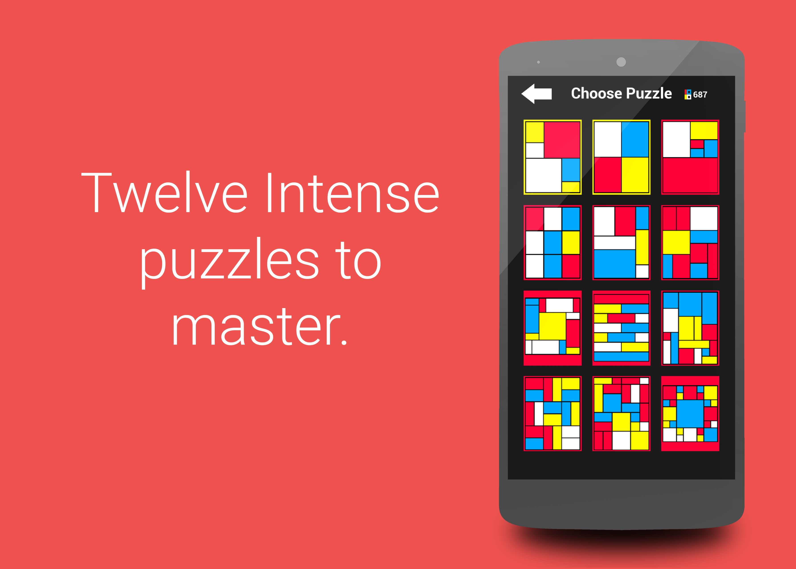
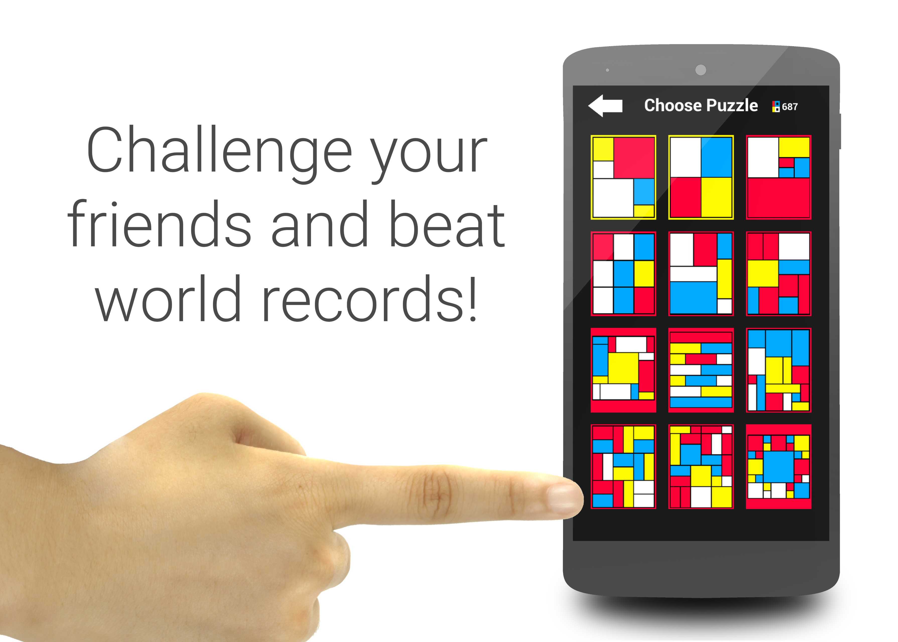

<h1>
Puxxle - Matching Puzzle Game
</h1>

Puxxle is a unique puzzle game in which you tap on squares of alternating colors. Make all colors the same to win. The fun lies in discovering the algorithms to solve the puzzles as well as challenging records.

### [*Play it right now in your desktop web browser!*](https://ryanawalters.github.io/Puxxle/)

This game was made completely by myself in the Summer of 2016. It is made in Unreal Engine and is published to the Google Play Store. The game implements saving, digital currency, and in-app purchases for Android.

You can read more about it and download it on your Android device here:
### [Puxxle - Matching Puzzle Game](https://play.google.com/store/apps/details?id=com.illiquid.puzzle)

---

<b>Watch on Youtube:</b>  

     

**Excerpt from the Google Play Store page:**
<blockquote>
  <blockquote>
  
Puxxle is a unique, addictive, and challenging matching puzzle game much like the many different twisty puzzle cubes. Also much like those popular puzzles, the puzzles here can be very difficult until you figure out how to go about solving them. Puxxle is a collection of 12 puzzles that range from easy to mind-numbingly difficult with various difficulties for each puzzle. Each puzzle has a different layout with a different number of pieces and will therefore require a different set of algorithms to solve. Tapping on a square in Puxxle will change the color of that square. You must match all of the squares to beat the puzzle.

The real draw of this game is the competitive aspect. Much like twisty puzzle cubes, Puxxle can be solved competitively for world records. There are three different competitive challenges:

* Fastest Solve: This is the classic challenge. Solve the puzzle as fast as you can by matching all of the squares!

* Fewest Moves: Test your knowledge of the puzzle and algorithms by seeing how few moves it takes you to match the squares and solve the puzzle!

* Blind Solve: Look at the layout and memorize the colors of each piece, because as soon as you start, you will no longer be able to see what the colors of the pieces are, so you must match the pieces without looking!

So get out there with your friends and discover algorithms, learn to solve the puzzles, and compete to see who the best Puxxler is!

Puxxle uses the Unreal® Engine. Unreal® is a trademark or registered trademark of Epic Games, Inc. in the United States of America and elsewhere

Unreal® Engine, Copyright 1998 – 2016, Epic Games, Inc. All rights reserved.

All permissions required are required by Unreal Engine for the game to function.

IF YOU DISCOVER A BUG OR OTHER ISSUE, PLEASE EMAIL:
PlayPuxxle@gmail.com

</blockquote>
</blockquote>

